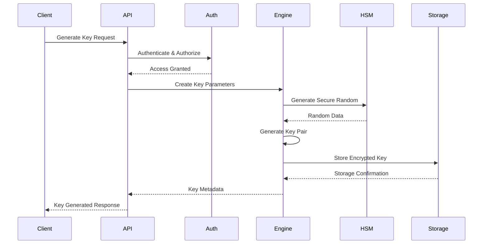
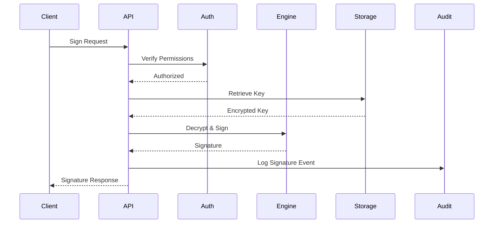

# Secure Key Management System (SKMS) - System Architecture

## Executive Summary

The Secure Key Management System (SKMS) is designed as a cryptographic key management solution that provides comprehensive HD wallet functionality, advanced cryptographic operations, and secure key lifecycle management. This document outlines the system architecture, component interactions, and design decisions.

## Architectural Principles

### Core Design Principles

1. **Security First**: All components designed with security as the primary consideration
2. **Modularity**: Clear separation of concerns with well-defined interfaces
3. **Performance**: Optimized for high-throughput cryptographic operations
4. **Scalability**: Horizontal scaling capabilities for enterprise deployment
5. **Compliance**: Built to meet regulatory requirements (FIPS 140-2, Common Criteria)
6. **Extensibility**: Plugin architecture for new cryptographic algorithms

### Security Principles

- **Zero Trust Architecture**: Never trust, always verify
- **Defense in Depth**: Multiple layers of security controls
- **Least Privilege**: Minimal access rights for all components
- **Fail Secure**: System fails to a secure state
- **Cryptographic Agility**: Support for algorithm migration

## High-Level Architecture

### 5-Layer Architecture

The SKMS follows a 5-layer architecture pattern as defined in the PRD:

```
┌─────────────────────────────────────────────────────────────┐
│                   Integration Layer                         │
│  ┌─────────────────┐ ┌─────────────────┐ ┌─────────────────┐│
│  │   Web Dashboard │ │   CLI Tools     │ │   SDKs/APIs     ││
│  └─────────────────┘ └─────────────────┘ └─────────────────┘│
└─────────────────────────────────────────────────────────────┘
┌─────────────────────────────────────────────────────────────┐
│                     API Layer                               │
│  ┌─────────────────┐ ┌─────────────────┐ ┌─────────────────┐│
│  │   REST API      │ │   gRPC API      │ │   GraphQL API   ││
│  └─────────────────┘ └─────────────────┘ └─────────────────┘│
└─────────────────────────────────────────────────────────────┘
┌─────────────────────────────────────────────────────────────┐
│                    Security Layer                           │
│  ┌─────────────────┐ ┌─────────────────┐ ┌─────────────────┐│
│  │ Authentication  │ │ Authorization   │ │  Audit Logging  ││
│  │   - JWT/OAuth   │ │   - RBAC/ABAC   │ │   - Tamper-     ││
│  │   - API Keys    │ │   - Policies    │ │     Evident     ││
│  └─────────────────┘ └─────────────────┘ └─────────────────┘│
└─────────────────────────────────────────────────────────────┘
┌─────────────────────────────────────────────────────────────┐
│                     Core Engine                             │
│  ┌─────────────────┐ ┌─────────────────┐ ┌─────────────────┐│
│  │ Cryptographic   │ │   HD Wallet     │ │  Key Lifecycle  ││
│  │    Engine       │ │    Engine       │ │   Management    ││
│  │ - Primitives    │ │ - BIP32/39/44   │ │ - Generation    ││
│  │ - PQC Support   │ │ - Multi-chain   │ │ - Rotation      ││
│  │ - ZK Proofs     │ │ - Signatures    │ │ - Backup        ││
│  └─────────────────┘ └─────────────────┘ └─────────────────┘│
└─────────────────────────────────────────────────────────────┘
┌─────────────────────────────────────────────────────────────┐
│                    Storage Layer                            │
│  ┌─────────────────┐ ┌─────────────────┐ ┌─────────────────┐│
│  │ Encrypted Key   │ │   Metadata      │ │   HSM/Secure    ││
│  │    Storage      │ │    Database     │ │    Enclaves     ││
│  │ - AES-256-GCM   │ │ - PostgreSQL    │ │ - PKCS#11       ││
│  │ - Key Wrapping  │ │ - Redis Cache   │ │ - Cloud HSMs    ││
│  └─────────────────┘ └─────────────────┘ └─────────────────┘│
└─────────────────────────────────────────────────────────────┘
```

## Component Architecture

### Core Engine Components

#### 1. Cryptographic Engine (`internal/crypto`)

**Responsibility**: Core cryptographic operations and primitives

**Sub-components**:

- **Symmetric Crypto**: AES-GCM, ChaCha20-Poly1305
- **Asymmetric Crypto**: RSA, ECC (secp256k1, P-256, Ed25519)
- **Hash Functions**: SHA-2, SHA-3, BLAKE2
- **Key Derivation**: PBKDF2, Argon2, HKDF, scrypt
- **Random Number Generation**: Cryptographically secure RNG
- **Post-Quantum Crypto**: Dilithium, Falcon, Kyber
- **Zero-Knowledge Proofs**: zk-SNARKs, zk-STARKs

**Key Features**:

- Constant-time implementations
- Hardware acceleration (AES-NI, NEON)
- Side-channel attack resistance
- Memory-safe operations

#### 2. HD Wallet Engine (`internal/wallet`)

**Responsibility**: Hierarchical Deterministic wallet operations

**Sub-components**:

- **BIP39 Mnemonic**: Generation and validation
- **BIP32 Key Derivation**: Hierarchical key derivation
- **BIP44 Account Structure**: Multi-account hierarchy
- **Multi-Signature**: M-of-N signature schemes
- **Threshold Signatures**: Distributed signing

**Key Features**:

- Multi-blockchain support (Ethereum, Bitcoin, Solana)
- Deterministic address generation
- Secure seed management
- Cross-chain compatibility

#### 3. Key Lifecycle Management (`internal/keys`)

**Responsibility**: Complete key lifecycle operations

**Sub-components**:

- **Key Generation**: Secure key creation
- **Key Rotation**: Automated and manual rotation
- **Key Backup**: Secure backup and recovery
- **Key Escrow**: Enterprise key escrow
- **Key Expiration**: Lifecycle management

### API Layer Components

#### 1. REST API (`internal/api/rest`)

**Responsibility**: RESTful HTTP API for key management

**Features**:

- OpenAPI 3.0 specification
- JSON request/response
- HTTP/2 support
- Rate limiting
- Request validation

#### 2. gRPC API (`internal/api/grpc`)

**Responsibility**: High-performance RPC API

**Features**:

- Protocol Buffers
- Bidirectional streaming
- Load balancing
- Connection pooling
- Service discovery

### Security Layer Components

#### 1. Authentication (`internal/auth`)

**Responsibility**: User and service authentication

**Methods**:

- JWT tokens
- API keys
- OAuth 2.0
- mTLS certificates
- Biometric authentication

#### 2. Authorization (`internal/authz`)

**Responsibility**: Access control and permissions

**Models**:

- Role-Based Access Control (RBAC)
- Attribute-Based Access Control (ABAC)
- Policy-based authorization
- Resource-level permissions

#### 3. Audit Logging (`internal/audit`)

**Responsibility**: Security event logging and compliance

**Features**:

- Tamper-evident logs
- Structured logging (JSON)
- Real-time monitoring
- Compliance reporting
- Log integrity verification

### Storage Layer Components

#### 1. Encrypted Storage (`internal/storage`)

**Responsibility**: Secure data persistence

**Features**:

- Envelope encryption
- Key wrapping
- Storage abstraction
- Backup and recovery
- Data integrity verification

#### 2. HSM Integration (`internal/hsm`)

**Responsibility**: Hardware security module integration

**Supported HSMs**:

- PKCS#11 compatible devices
- AWS CloudHSM
- Azure Dedicated HSM
- Google Cloud HSM
- Apple Secure Enclave
- TPM modules

## Data Flow Architecture

### Key Generation Flow



### Signature Flow



## Deployment Architecture

### Production Deployment

```
┌─────────────────────────────────────────────────────────────┐
│                      Load Balancer                         │
│                    (NGINX/HAProxy)                         │
└─────────────────────────────────────────────────────────────┘
                              │
        ┌─────────────────────┼─────────────────────┐
        │                     │                     │
┌───────▼──────┐    ┌─────────▼──────┐    ┌─────────▼──────┐
│   SKMS Pod   │    │   SKMS Pod     │    │   SKMS Pod     │
│              │    │                │    │                │
│ ┌──────────┐ │    │ ┌──────────┐   │    │ ┌──────────┐   │
│ │   API    │ │    │ │   API    │   │    │ │   API    │   │
│ └──────────┘ │    │ └──────────┘   │    │ └──────────┘   │
│ ┌──────────┐ │    │ ┌──────────┐   │    │ ┌──────────┐   │
│ │  Engine  │ │    │ │  Engine  │   │    │ │  Engine  │   │
│ └──────────┘ │    │ └──────────┘   │    │ └──────────┘   │
└──────────────┘    └────────────────┘    └────────────────┘
        │                     │                     │
        └─────────────────────┼─────────────────────┘
                              │
┌─────────────────────────────▼─────────────────────────────┐
│                    Shared Services                        │
│  ┌─────────────┐ ┌─────────────┐ ┌─────────────┐          │
│  │ PostgreSQL  │ │    Redis    │ │    HSM      │          │
│  │  (Metadata) │ │   (Cache)   │ │  (Secure    │          │
│  │             │ │             │ │   Keys)     │          │
│  └─────────────┘ └─────────────┘ └─────────────┘          │
└─────────────────────────────────────────────────────────────┘
```

### Container Architecture

```dockerfile
# Multi-stage build for security and size optimization
FROM golang:1.21-alpine AS builder
# Build stage configuration

FROM scratch AS runtime
# Minimal runtime with only binary and certificates
```

## Security Architecture

### Threat Model

**Assets Protected**:

1. Private cryptographic keys
2. User authentication credentials
3. System configuration data
4. Audit logs and compliance data

**Threat Actors**:

1. External attackers
2. Malicious insiders
3. Nation-state actors
4. Supply chain compromises

**Attack Vectors**:

1. Network-based attacks
2. Side-channel attacks
3. Social engineering
4. Physical access
5. Software vulnerabilities

### Security Controls

#### Preventive Controls

- Multi-factor authentication
- Zero-trust network architecture
- Input validation and sanitization
- Secure coding practices
- Regular security assessments

#### Detective Controls

- Real-time monitoring
- Anomaly detection
- Security event correlation
- Compliance auditing
- Penetration testing

#### Responsive Controls

- Incident response procedures
- Key revocation mechanisms
- System isolation capabilities
- Forensic logging
- Backup and recovery

## Performance Requirements

### Throughput Targets

- **Key Generation**: 1,000 keys/second
- **Digital Signatures**: 10,000 signatures/second
- **API Response Time**: < 100ms (95th percentile)
- **Concurrent Users**: 100,000+

### Scalability

- **Horizontal Scaling**: Auto-scaling based on load
- **Geographic Distribution**: Multi-region deployment
- **Load Distribution**: Consistent hashing for key distribution

## Technology Stack

### Core Technologies

- **Language**: Go 1.21+
- **Cryptography**: Native Go crypto + custom implementations
- **Database**: PostgreSQL 15+ (metadata), Redis (caching)
- **Message Queue**: Apache Kafka (audit logs)
- **Container**: Docker + Kubernetes
- **Service Mesh**: Istio (for mTLS and observability)

### Development Tools

- **Build**: Go modules, Make
- **Testing**: Go testing, Testify
- **CI/CD**: GitHub Actions, ArgoCD
- **Monitoring**: Prometheus, Grafana, Jaeger
- **Documentation**: Swagger/OpenAPI, GitHub Pages

## Compliance and Standards

### Cryptographic Standards

- **NIST**: FIPS 140-2 Level 3/4 compliance
- **Common Criteria**: EAL4+ certification target
- **PKCS**: PKCS#11 for HSM integration

### Industry Standards

- **SOC 2 Type II**: Annual compliance audit
- **ISO 27001**: Information security management
- **PCI DSS**: Payment card industry compliance
- **GDPR**: Data protection regulation compliance

## Migration and Versioning

### API Versioning

- Semantic versioning (semver)
- Backward compatibility guarantees
- Deprecation notices and timelines

### Data Migration

- Zero-downtime deployments
- Database migration scripts
- Key migration procedures
- Rollback capabilities

## Monitoring and Observability

### Metrics

- Business metrics (keys generated, signatures created)
- System metrics (CPU, memory, network, disk)
- Application metrics (API latency, error rates)
- Security metrics (failed authentication attempts)

### Logging

- Structured logging (JSON format)
- Centralized log aggregation
- Log retention policies
- Security event correlation

### Tracing

- Distributed tracing with OpenTelemetry
- Request flow visualization
- Performance bottleneck identification
- Error root cause analysis

## Future Considerations

### Roadmap Items

1. **Quantum Resistance**: Full post-quantum cryptography migration
2. **Multi-Party Computation**: Advanced secure computation
3. **Blockchain Integration**: Native DeFi protocol support
4. **AI/ML Integration**: Anomaly detection and automated response
5. **Edge Computing**: Lightweight edge deployment

### Emerging Technologies

- **Confidential Computing**: Intel SGX, AMD SEV
- **Homomorphic Encryption**: Computation on encrypted data
- **Verifiable Computation**: Zero-knowledge proof systems
- **Decentralized Identity**: Self-sovereign identity protocols

---

**Document Version**: 1.0  
**Last Updated**: June 16, 2025  
**Next Review**: September 16, 2025  
**Owner**: Architecture Team  
**Approvers**: Security Team, Engineering Leadership
